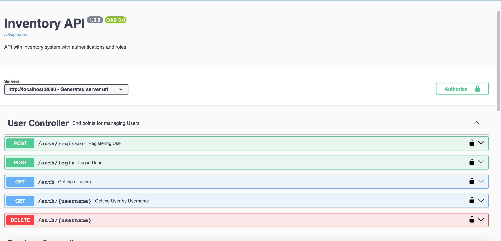
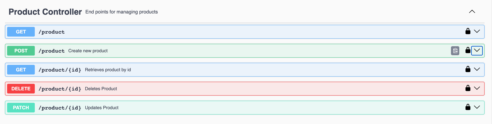

# Inventory Management System API


[](https://codecov.io/gh/NatePombi/inventory-management-system-api)


This is a Spring Boot REST API I’m building to manage products and users in an inventory system.
It supports JWT authentication, role-based access control, and CRUD operations for products.

Right now it’s fully functional, but I’ll keep improving it over time.

---

#### Features (So Far)
*  User Authentication with JWT (Register & Login).

* Role-based access control (User vs Admin).

* Product Management (CRUD):

  * Create products

   * Update product details

    * Delete products

    * Get product by ID

* User Management (Admin only):

  * View all users

  * Get a user by username

  * Delete a user

---

### Tech Stack

* 

* 

* 

* 

* 

* 

* 
* 


---

### Future Plans

* Docker & Docker Compose (with Postgres)

* Deploy online (Railway/Render/Heroku) for live demo

* Analytics dashboard (product stock levels, sales trends, etc.)

--- 
### Environment Variable

This project use a '.env' file to store configuration values the database, there is a template named "envtemplate.env.example" showing you exactly how it should look like.

Create a '.env' file in the **project root**:

```env

DB_URL=jdbc:postgresql://localhost:5432/InventoryAPI

DB_USERNAME=yourusername 

DB_PASSWORD=yourpassword
```
---


### Database Configuration

- This project uses PostgreSQl.

      1. Go to your .env file in your project root. 
      2. Configure the database details to your custom details.
      3. Go to Run -> Edit Connfiguration -> Environment Variables
      4. Enable your .env file ( use the EnvFile plugin)

- Steps to set up the database:

  - Make sure PostgreSQL is installed and running.

  - Create the database:

    - CREATE DATABASE inventoryAPI;
    - Update the username and password in application.properties to your own.
    - When you run the Spring Boot app, JPA/Hibernate will automatically create/update tables.
    
  

---
### Admin Seeding

- Admin User (Seeded on Runtime)
  - For testing and management purposes, the application automatically creates and admin user when applications starts. This ensures that theres always at least one admin present.

  - Credentials:
    ```json
    {
      "username": "admin",
      "password": "admin123"
    }


### How to Use (For Now)

1) Clone the repo

- git clone https://github.com/NatePombi/inventory-management-system-api


2) Navigate into the project

- cd inventory-management-system-api


3) Run the project

- ./mvnw spring-boot:run


4) Open Swagger docs in browser:

- http://localhost:8080/swagger-ui/index.html


---

### Status

- This project is actively maintained and open for improvements and contributions.

---

##  Postman Collection

You can import the full Postman collection to test the API:

[📥 Download Postman Collection](./docs/postman_collection.json)

---
### Swagger Ui
You can explore swagger UI here :  [http://localhost:8080/swagger-ui/index.html](http://localhost:8080/swagger-ui/index.html)





--
### Sample API calls

Register User
**POST** `/auth/register`
```json
{
  "username": "john",
  "email": "john@gmail.com",
  "password": "pass123"
}
```

Login User
**POST** `/auth/login`
```json
{
  "username": "john",
  "password": "password123"
}
```

Create Product
**POST** `/product`
```json
{
  "name": "Laptop",
  "description": "HP Pavilion 15",
  "price": 14999.99,
  "quantity": 10
}
```

Response:
```json
{
  "id": 1,
  "name": "Laptop",
  "price": 14999.99,
  "quantity": 10
}
```


